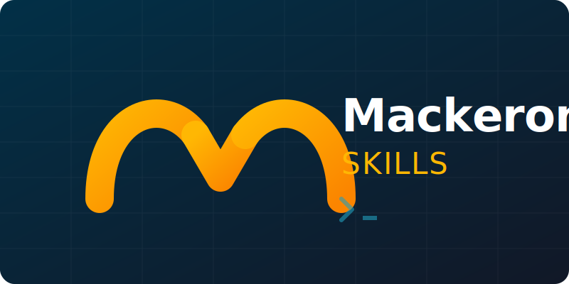

<div align="center">
  

  # Mackeroni Skills

  **A curated collection of specialized, high-signal agent skills for Claude Code and Gemini CLI.**

  [](https://github.com/thedotmack/mackeroni-skills/blob/main/LICENSE)
  [](#included-skills)
  [](https://github.com/thedotmack/mackeroni-skills/pulls)
</div>

---

## ⚡ What are Agent Skills?

Skills are modular, self-contained packages that extend the capabilities of AI coding agents like [Claude Code](https://docs.anthropic.com/en/docs/agents-and-tools/claude-code/overview) and Gemini CLI. They provide specialized procedural knowledge, workflows, and tools—transforming a general-purpose agent into a domain expert.

This repository houses a collection of battle-tested skills designed to streamline development, automate releases, and enforce design systems.

## 📦 Included Skills

| Skill | Description | Best For |
| :--- | :--- | :--- |
| **🎨 [ux-designer](./ux-designer)** | @thedotmack's personal landing page design system. Covers visual hierarchy, UX patterns, marketing copy, messaging strategy, and conversion optimization. | Building high-conversion landing pages, marketing sites, and product pages. |
| **🚀 [claude-code-plugin-release](./claude-code-plugin-release)** | Automated semantic versioning and release workflow specifically tailored for Claude Code plugins (`package.json`, `marketplace.json`, `plugin.json`). | Managing Claude Code plugin releases. |
| **🔄 [release-and-auto-changelog](./release-and-auto-changelog)** | A generic, automated release workflow for any repository. Handles git tagging, GitHub releases, and automated changelog generation. | Standardizing release workflows across any repo. |

---

## 🛠️ Installation & Usage

Agent skills are designed to be cloned directly into your local agent configuration directory.

### For Claude Code

1. Copy the desired skill directory into your Claude Code skills folder:
   ```bash
   # Example: Installing the ux-designer skill
   cp -r ux-designer ~/.claude/skills/
   ```

2. Invoke the skill naturally in your conversation with Claude:
   > *"Use the ux-designer skill to help me layout a landing page for my new SaaS."*

### For Gemini CLI

1. Copy the desired skill directory into your Gemini skills folder:
   ```bash
   # Example: Installing the release-and-auto-changelog skill
   cp -r release-and-auto-changelog ~/.agents/skills/
   ```

2. Invoke the skill:
   > *"/activate_skill release-and-auto-changelog"*

---

## 🤝 Contributing

Contributions are welcome! If you have a highly effective workflow, design system, or script set that you've codified into a skill, feel free to submit a Pull Request.

When creating a new skill, please ensure it adheres to the [skill-creator guidelines](https://docs.anthropic.com/en/docs/agents-and-tools/claude-code/skills) (concise `SKILL.md`, separate scripts/references, no extraneous documentation).

## 📄 License

This repository is licensed under the MIT License. See the [LICENSE](LICENSE) file for details.
